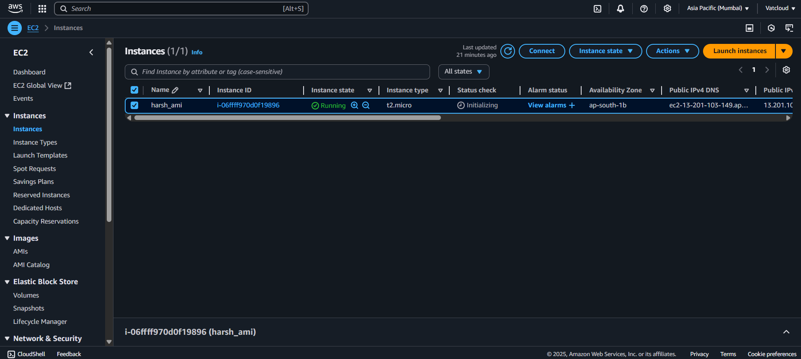
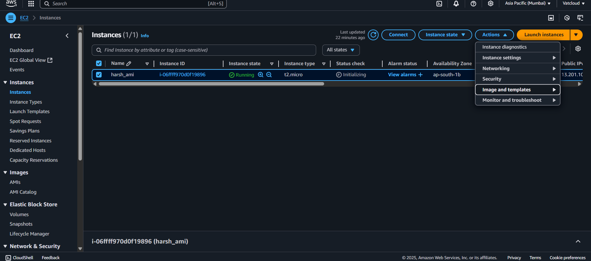
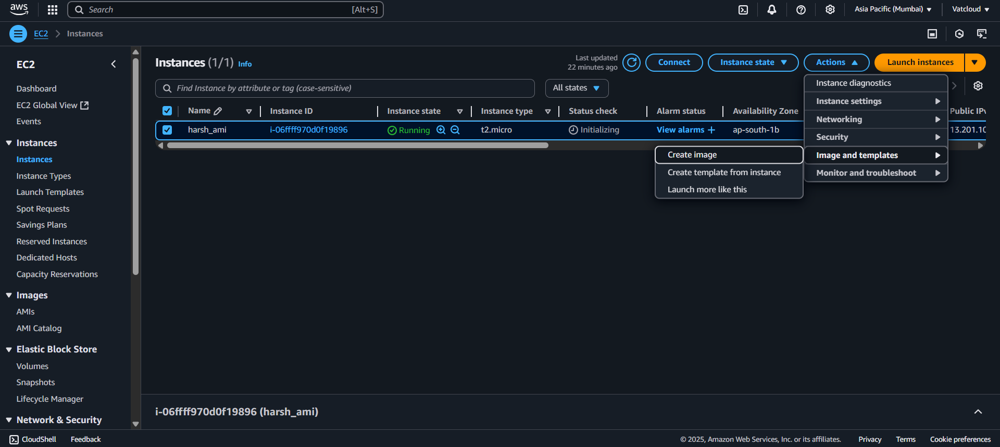
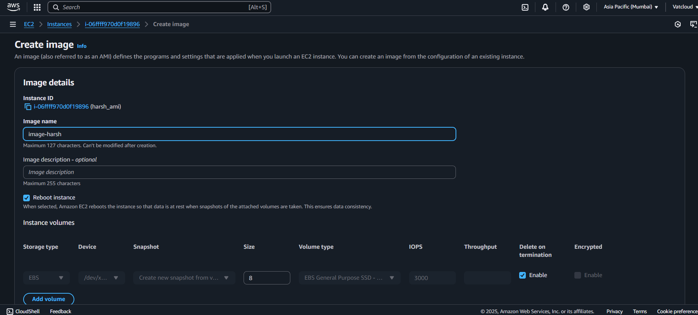
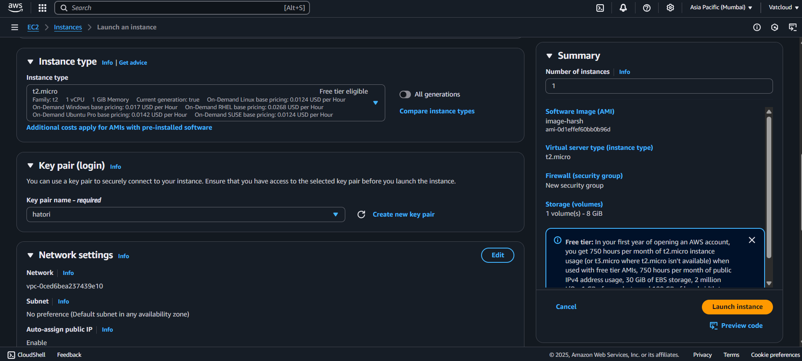
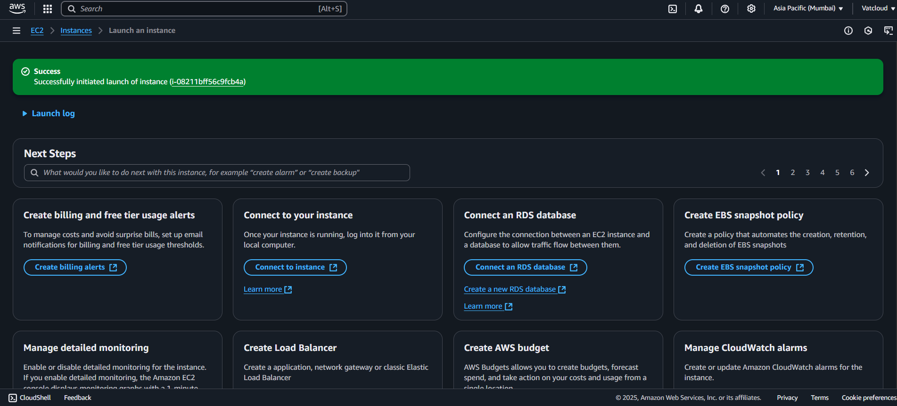

  

<h1 align="center" style="color:#2E86C1;">AWS EC2 – AMI Creation & Launch Guide </h1>
 

---

## 📝 Introduction  

This guide explains how to create an **Amazon Machine Image (AMI)** from an existing Linux EC2 instance and how to **launch a new instance from that AMI**.

In this process, you’ll learn how to:  
✅ Save your EC2 instance as a reusable image  
✅ Quickly deploy identical instances from your AMI  
✅ Clean up unused resources to avoid charges  

 

---

## ⚙️ Prerequisites  

Before you begin:  

- **Launch a Linux or Windows EC2 Instance**  
   - Choose either **Linux** or **Windows** server as per your requirement.  
   - **Host any basic application or webpage** (e.g., a simple `index.html`).  
   - If you need help with server setup, refer to:  
     - 👉 [Linux EC2 Server Setup Guide](https://github.com/Vatsaly76/aws-internship/blob/main/server-creation/linux-server/linux.md)  
     - 👉 [Windows EC2 Server Setup Guide](https://github.com/Vatsaly76/aws-internship/blob/main/server-creation/windows-server/windows-server.md)  

---

 

## 🔥 Steps to Create AMI and Launch New Instance  

---

### ✅ Step 1: Go to **Actions** Menu  
- Navigate to your running EC2 instance  
- Click on **Actions** menu  

---

### ✅ Step 2: Select **Image and Templates → Create Image**  
- Under **Actions**, choose **Image and Templates**  
- Click **Create Image**  

  
  

---

### ✅ Step 3: Fill Image Details  
- Provide **Image Name** and optional description  

  

---

---

### ✅ Step 4: Launch New Instance from AMI  
- Go to **AMIs**, select your created AMI  
- Click **Launch Instance**  
- Choose:  
   - **Instance Type** (e.g., t2.micro for free tier)  
   - **Key Pair** for SSH access  
- Click **Launch**  

  

---

### ✅ Final Step: Instance Ready  
- After successful launch, your new instance will be in **Running** state  
- You can now SSH into your new server  

  

---

## 🔍 Important Notes  
- ❗ **You cannot change the OS** using AMI, but you can **change instance type** during launch.  
- ✅ AMI helps replicate identical environments quickly.  

---

 
