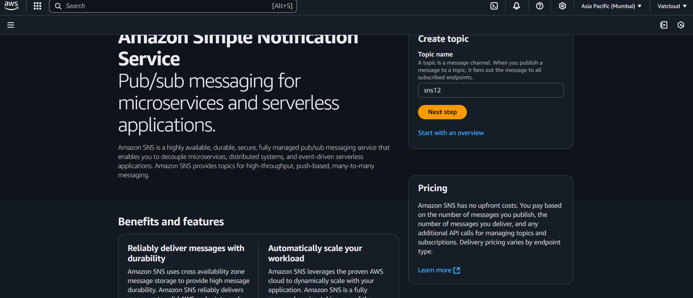
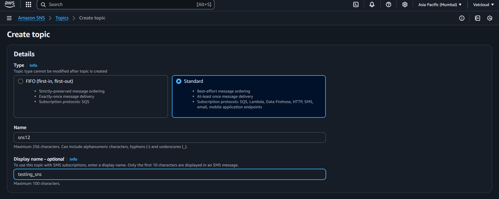
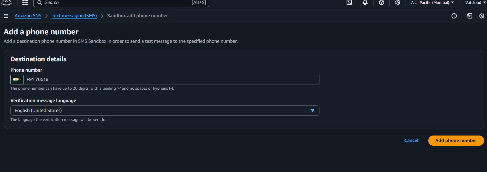
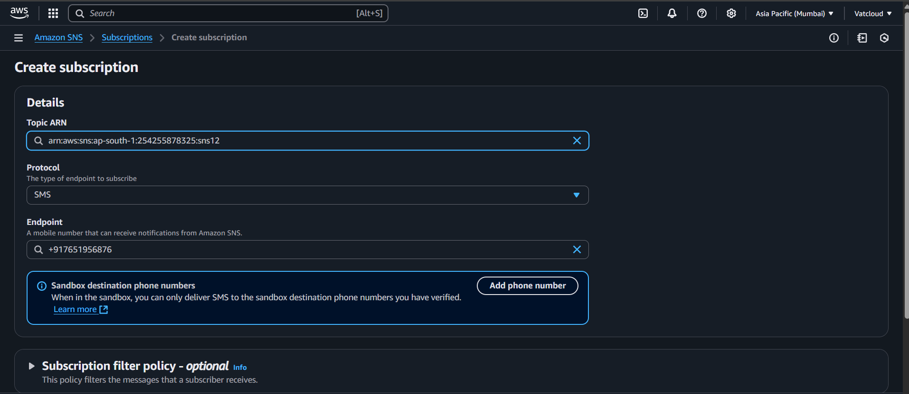
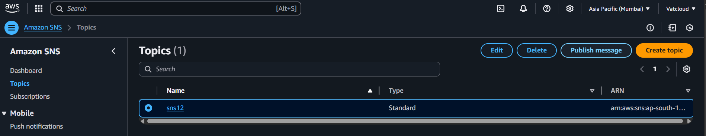
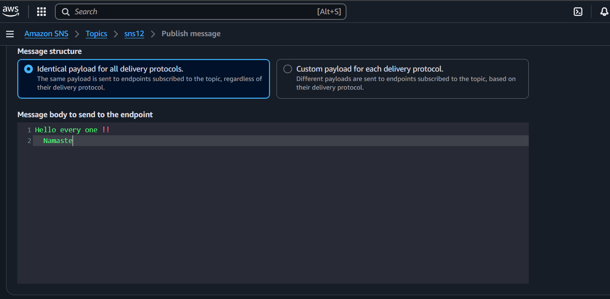
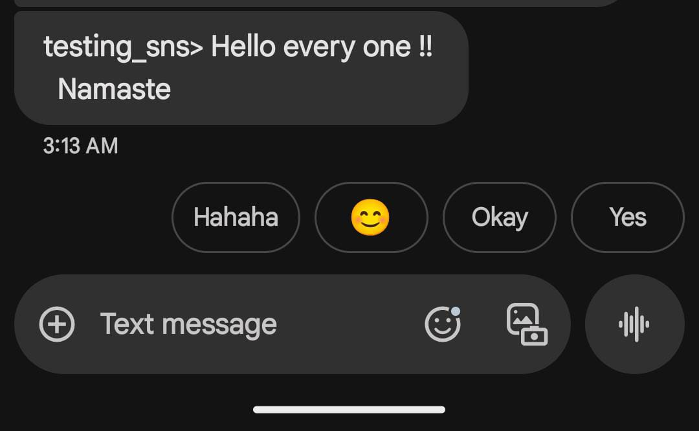

# 📬 AWS SNS (Simple Notification Service)

## 🔹 What is SNS?

**Amazon SNS** is a fully managed messaging service used to send notifications (SMS, email, etc.) from the cloud using a publish-subscribe model.

---

## 🔀 Types of Topics

### Standard
- High throughput
- At-least-once delivery
- Supports SMS, Email, Lambda, etc.

### FIFO (First-In-First-Out)
- Exactly-once delivery
- Strict order
- Best for financial or transactional systems
- ❌ Does **not support** SMS and Email

👉 **We'll use Standard type here**.

---

## 🛠️ Steps to Send SMS Using SNS

### ✅ Step 1: Search SNS and Click Create Topic

Search **SNS** in AWS Console and click on **Create topic**.  

---

### ✅ Step 2: Topic Details (Type, Name, Display Name)

- Select **Standard**
- Enter **name**
- Enter **display name**
- Then click **Create topic**  

---

### ✅ Step 3: Create Subscription

Open the created topic and click on **Create subscription**.  

---

### ✅ Step 4: Add a Phone Number

- Select **Protocol** as `SMS`
- Add a **sandbox phone number**  

---

### ✅ Step 5: Click Create Subscription

Once phone number is verified with OTP, click **Create subscription**.  

---

### ✅ Step 6: Publish a Message

- Go back to the topic
- Click **Publish message**  

---

### ✅ Step 7: Write Your Message

- Fill in the **message body** and optionally a **subject**
- Click **Publish**  

---

### ✅ Step 8: Message Received

The SMS will be delivered to the phone number.  

---

