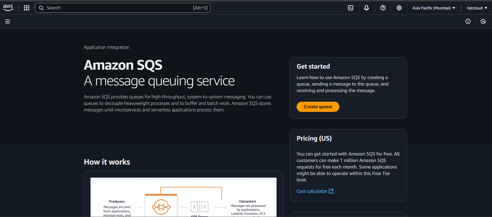
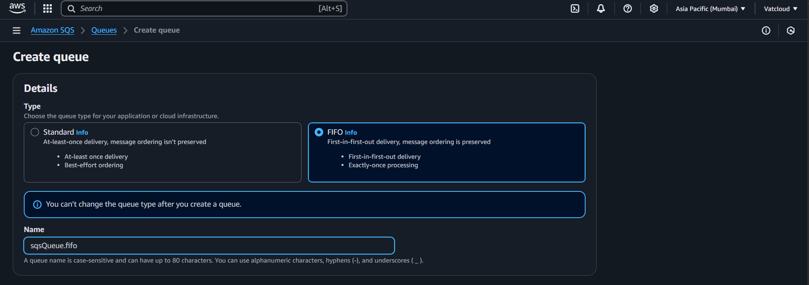
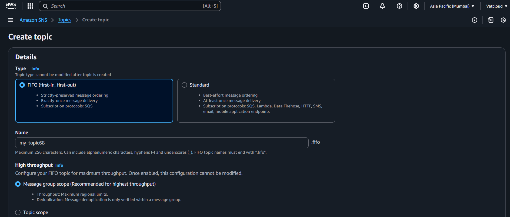
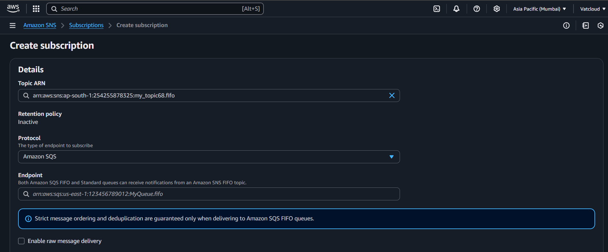
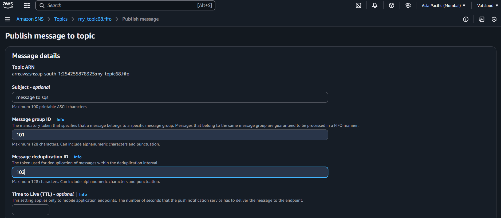
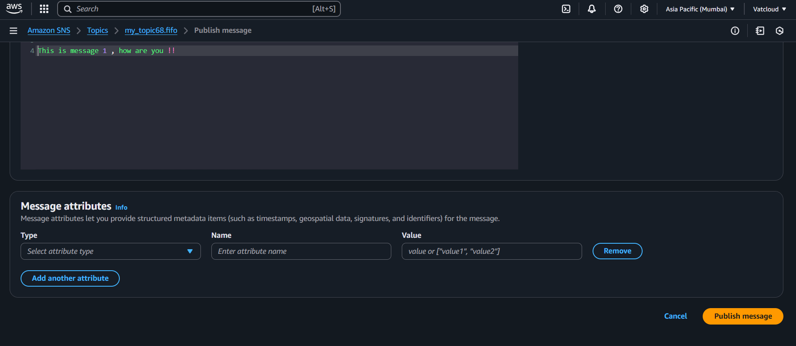
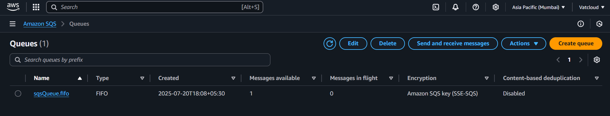
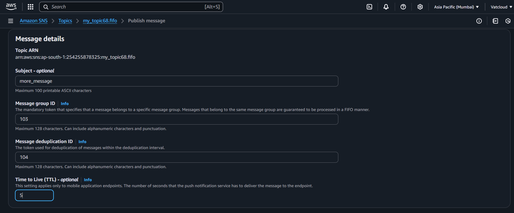
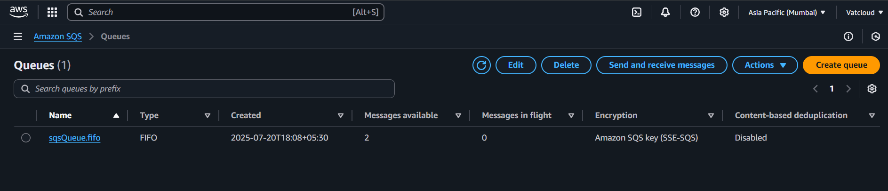

# 📥 AWS SQS (Simple Queue Service) + SNS Integration

## 📌 What is SQS?

**Amazon SQS** is a fully managed message queuing service that enables you to decouple and scale microservices, distributed systems, and serverless applications. It allows you to send, store, and receive messages between software components.

---

## 🔀 Types of Queues

### ✅ Standard
- Nearly unlimited transactions per second
- Best-effort ordering
- At-least-once delivery

### 🔒 FIFO (First-In-First-Out)
- Exactly-once processing
- Preserves the exact order
- Queue name must end with `.fifo`

👉 In this setup, we’ll use **FIFO** queue to preserve order.

---

## 🛠️ Steps to Create and Link SQS with SNS

### ✅ Step 1: Open SQS and Click Create Queue

Go to **Amazon SQS** in the AWS Console and click **Create Queue**.  

---

### ✅ Step 2: Fill Queue Details

- **Type**: FIFO  
- **Name**: `myQueue.fifo`  
Then click **Create Queue**.  

---

### ✅ Step 3: Create a Topic in SNS

Go to SNS and click on **Create Topic**. Fill in the topic details.  
(Same steps as done in the SNS module.)  

---

### ✅ Step 4: Create Subscription to SQS

- Go to the SNS topic  
- Click **Create subscription**  
- **Protocol**: `Amazon SQS`  
- Choose the SQS queue created earlier (`myQueue.fifo`)  

---

### ✅ Step 5: Publish a Message (After Subscription is Created)

Now publish a message to the SNS topic.  
- Add Subject and Message body  
- Click **Publish Message**  
  

---

### ✅ Step 6: Verify in SQS – Message Received

Go back to the SQS dashboard.  
You’ll see `Message Available: 1` – this confirms the message was received.  

---

### ✅ Step 7: Publish Another Message

Send another message from the SNS topic again.  
You’ll now see `Message Available: 2` in SQS.  
  

---

## 🎯 Summary

- ✅ I created a **FIFO queue**
- ✅ Integrated it with **SNS topic**
- ✅ Published multiple messages to SQS via SNS
- ✅ Confirmed message delivery via SQS dashboard

