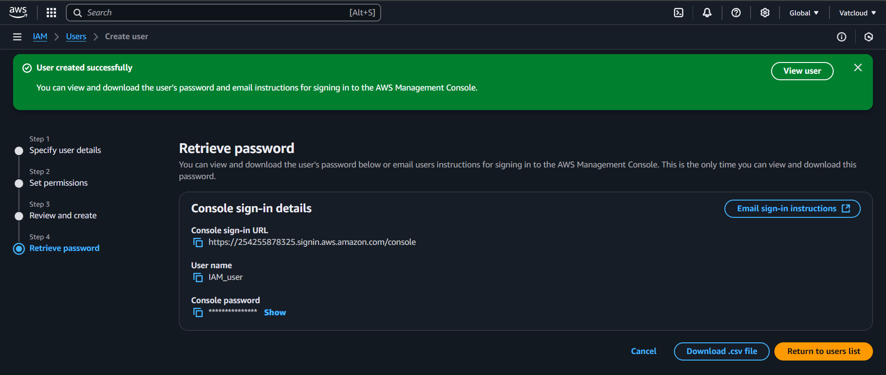

# 🔐 IAM (Identity and Access Management)

## 📘 What is IAM?

**IAM (Identity and Access Management)** is a foundational AWS service that helps you securely control access to AWS resources. With IAM, you can:
- Create and manage **users**, **groups**, and **roles**
- Define **permissions** to allow or deny access to specific AWS services
- Enforce **best security practices** such as least privilege and multi-factor authentication

IAM enables centralized access control in your AWS account, making it easy to give limited or full access to developers, admins, applications, or third parties — all while ensuring your AWS environment remains secure.

---

## 🎯 Objective of This Section

In this section, we walk through the **step-by-step creation of an IAM user**, how to **assign specific permissions (SNS access)**, and how that IAM user **independently publishes a message using AWS SNS**.

---

## 🛠 Step-by-Step Instructions:

### ✅ Step 1: Navigate to IAM Dashboard
- Go to the **AWS Console**
- Search for **IAM** and open the **IAM Dashboard**

---

### ✅ Step 2: Create a New IAM User
- Click on the **Users** tab in the sidebar
- Click on the **"Create User"** button

---

### ✅ Step 3: User Details
- Enter the **Username**
- Enable: `Provide user access to the AWS Management Console`
- Choose: `I want to create an IAM user`
- Set a **Custom Password**

---

### ✅ Step 4: Set Permissions
- Choose **Attach policies directly**
- Search and attach the **SNS** policy  
> ℹ️ _Note: AWS provides 1381+ policies — root users can assign roles based on project needs._

---

### ✅ Step 5: Review and Create
- Review all user details and permissions
- Click **Create User**

---

### ✅ Step 6: User Created Successfully
- IAM User is now created
- Console provides **Sign-In URL**, **Username**, and **Password**

---

### ✅ Step 7: IAM User Sign-In
- IAM user signs in using:
  - **Account ID / Sign-In URL**
  - **Username**
  - **Password**

---

### ✅ Step 8: IAM User Console Interface
- IAM user successfully accesses AWS Console with limited permissions

---

### ✅ Step 9: SNS Integration
- IAM user searches for **SNS**
- Creates **Topic** and then adds **Subscription**

---

### ✅ Step 10: Publish SNS Message
- Message is published to the topic created earlier

---

### ✅ Step 11: Message Received
- SMS received on the **phone number** subscribed by the IAM user

---

