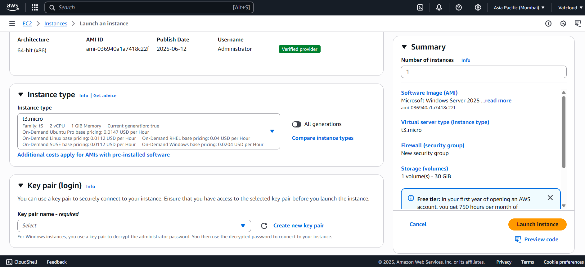
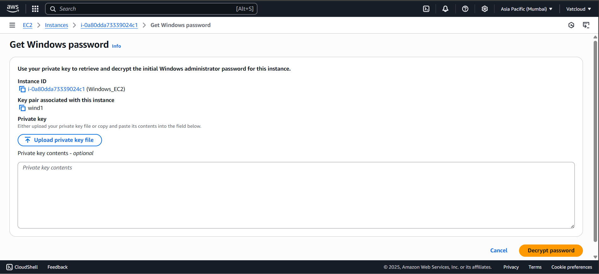

# 🚀 Launching a Windows Server on AWS EC2

This updated guide helps you launch a Windows EC2 instance and connect via RDP, with clearer step structure and updated media.

---

### 🖥️  **Step 1: Go to EC2 and Launch an Instance**
- Open the AWS Management Console and navigate to the **EC2** service  
- Click **Launch Instance** to begin  

---

### 🪪  **Step 2: Name the Server and Select Windows AMI**
- Enter an instance name like `MyWindowsServer`  
- Under **Application and OS Images (Amazon Machine Image)**, select a Windows Server AMI (e.g., Windows Server 2025)  

---

### ⚙️  **Step 3: Choose Instance Type & Key Pair**
- Choose **t3.micro** (eligible under the Free Tier)  
- Create a new key pair or choose an existing one for password decryption later  

---

### 🌐  **Step 4: Configure Network Settings and Launch**
- Under **Network Settings**, make sure port **3389 (RDP)** is open  
- Optionally allow HTTP/HTTPS if needed  
- Click **Launch Instance**  

---

### 🔗  **Step 5: Connect to the Windows Server**
- After the instance is running, select it and click **Connect**  
- Choose **RDP Client**  

---

### 🖥️  **Step 6: Go to the RDP Client Tab**
- Download the **Remote Desktop file (.rdp)**  
- You’ll use this file to launch the remote session  

---

### 🔐  **Step 7: Get Windows Administrator Password**
- Click on **Get Password**  
- Upload your private key (.pem file)  
- Decrypt the password and copy it  

  

---

### 📥  **Step 8: Connect via Remote Desktop**
- Open the downloaded `.rdp` file  
- If prompted, bypass the security warning  
- Enter **Administrator** as username and the decrypted password  

  

---

### 🧑‍💼  **Step 9: Welcome to Windows Administration**
- You should now see the Windows Server desktop  
- Use it like a normal Windows machine for administration or hosting  

🎥 [Watch Video](https://drive.google.com/file/d/1SLiuOaVYLcNS3qfGUvHFU9Sa4ZcCK3cH/view)

---
